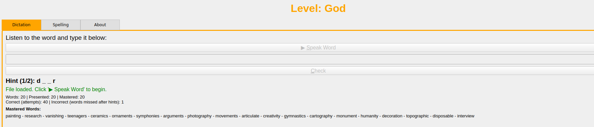

# listenANDwrite2memorize

**listenANDwrite2memorize** is an interactive desktop application designed to help users practice and improve their English dictation and spelling skills. It utilizes the [Piper Text-to-Speech (TTS)](https://github.com/rhasspy/piper) engine for an authentic auditory learning experience, combined with a gamified approach to make learning engaging.

## The "Why" Behind This Software

The journey to create **listenANDwrite2memorize** began as I watched my children prepare for their spelling bee. I saw firsthand the specific hurdles they faced, especially my younger child, who, as a non-native English speaker, sometimes struggled with the pronunciation of individual English letters, making spelling more challenging. This direct experience and the desire to provide them with a targeted tool to overcome these difficulties were the driving force behind the development of this software. I built it to cater to their learning needs.

## Key Features

1.  **Listen & Write (Main Practice Tab):**
    In this section, the software pronounces a complete English word. The student's task is then to type it out correctly. This feature focuses on reinforcing word recognition and accurate spelling through auditory input and written recall.

2.  **Listen to Spelling & Learn Letter Sounds (Targeted Learning Tab):**
    This tab was inspired directly by observing my younger child's learning process. It is especially beneficial for younger learners or anyone new to English phonetics who might find English letter sounds tricky.
    Here, the software dictates the word by *spelling it out loud, letter by letter*, clearly articulating the English pronunciation for each individual letter (e.g., "A" as /eɪ/, "B" as /biː/, "C" as /siː/). This method allows the student to simultaneously memorize the spelling sequence and the correct English sound of each letter that constitutes the word.

## Our Goal

My belief is that this dual approach not only aids significantly in preparing for spelling bees but, more broadly, helps children solidify their understanding of English words: how they are spelled and the sounds of the letters that build them. The ultimate goal of **listenANDwrite2memorize** is to make the process of learning and memorizing English words and their correct spellings more intuitive, effective, and a little less daunting.

## Features

*   **Interactive Dictation:** Listen to English words spoken by a Text-to-Speech engine and type them out. Receive immediate feedback on your attempts.
*   **Spelling Practice:** Listen to words being spelled out letter by letter and then type the complete word.
*   **Custom Word Lists:** Import your own lists of words from `.txt` files (one word per line) to focus on specific vocabulary.
*   **Adjustable Speech Speed:** Control the pronunciation speed with options like "Very Slow," "Slow," "Normal," "Fast," or let the application choose a "Random" speed for an added challenge.
*   **Voice Selection:** Choose from available voices (e.g., US Woman, GB Man) or select "Random" voice for varied listening practice.
*   **Progressive Hint System (Dictation Mode):**
    *   **Hint 1:** Shows the number of characters in the word (e.g., `_ _ _ _ _`).
    *   **Hint 2:** Reveals the first and last letters of the word (e.g., `h _ _ _ o`).
    *   **Hint 3:** Uncovers approximately 60% of the word's letters.
*   **Learning Reinforcement:** If all attempts and hints are exhausted for a word, the correct word is shown, and the user must type it correctly to proceed, reinforcing memory.
*   **Gamified Level System:** Progress through user levels (Noob, Pro, Hacker, God) based on consecutive correct answers, with visual feedback through changing interface colors.
*   **Visual Feedback:** Enjoy fun, random GIFs displayed for both correct answers and when all attempts for a word are exhausted.
*   **Progress Tracking & History:**
    *   The application automatically saves your progress (mastered words, correct/incorrect counts per word, consecutive correct answers for leveling) when you exit.
    *   When loading a word list, if a previous session exists, you'll be prompted to continue or restart.
    *   Option to manually reset progress for the currently loaded word list via the File menu.
*   **User-Friendly Interface:** Tabbed layout for easy navigation between Dictation, Spelling, and About sections.
*   **Keyboard Shortcuts:** Mnemonic shortcuts (e.g., `Alt+S` for "Speak Word") for quicker interaction.

## Dependencies

*   **Python 3.x**
*   **PyQt6:** For the graphical user interface.
    ```bash
    pip install PyQt6
    ```
*   **Piper TTS:** The Text-to-Speech engine.
    *   You need the Piper executable.
    *   You need at least one Piper voice model (e.g., `.onnx` file and its corresponding `.onnx.json` file).
*   **Audio Playback Utilities (Linux):**
    *   `aplay` (from `alsa-utils`) or `paplay` (from `pulseaudio-utils`) are used to play the audio generated by Piper.
    ```bash
    sudo apt update
    sudo apt install alsa-utils pulseaudio-utils
    ```
    (For other operating systems, you might need different audio playback command-line tools, and the `PiperTTSWorker` class in `main-gui.py` would need to be adapted.)

## Setup and Installation

1.  **Clone the Repository:**
    ```bash
    git clone <your-repository-url>
    cd listenANDwrite2memorize 
    ```
    (Replace `<your-repository-url>` with the actual URL of your GitHub repository).

2.  **Install Python Dependencies:**
    Make sure you have Python 3 installed. Then, install PyQt6:
    ```bash
    pip install PyQt6
    ```

3.  **Set up Piper TTS:**
    *   **Download Piper Executable:**
        *   Go to the Piper releases page.
        *   Download the appropriate executable for your operating system (e.g., `piper_linux_x86_64.tar.gz`).
        *   Extract the executable and place it in a directory. For this project, it's expected to be in a subfolder named `piper` relative to `main-gui.py` (i.e., `./piper/piper`).
    *   **Download Voice Models:**
        *   Piper requires voice models. You can find them linked from the Piper GitHub page or other sources providing Piper-compatible voices. Each voice consists of an `.onnx` file and a `.onnx.json` file (both must have the same base name).
        *   Place your downloaded voice model files into a subfolder named `piper_voices` relative to `main-gui.py` (e.g., `./piper_voices/en_US-hfc_female-medium.onnx`).
    *   **Configure Paths in `main-gui.py` (if necessary):**
        *   Open `main-gui.py` in a text editor.
        *   Locate the following constants at the top of the file:
            ```python
            CAMINHO_EXECUTAVEL_PIPER_DEFAULT = "./piper/piper"
            CAMINHO_MODELO_VOZ_ONNX_DEFAULT = "./piper_voices/en_US-hfc_female-medium.onnx"
            ```
        *   Adjust these paths if you placed the Piper executable or your default voice model elsewhere. The path for the second voice (`en_GB-alan-medium.onnx`) is also configured within the `MainWindow` class.

4.  **Prepare Image Directories (for GIFs):**
    *   Create a directory named `img` in the same location as `main-gui.py`. Place your success/celebration GIFs in this `img` directory.
    *   Inside the `img` directory, create another directory named `errors` (i.e., `img/errors/`). Place your "try again" or error-related GIFs in this `img/errors` directory.

5.  **Ensure Audio Playback:**
    *   On Linux, make sure `aplay` or `paplay` is installed (see Dependencies section). The application will try to use these to play audio.

## How to Use

1.  **Run the Application:**
    Navigate to the project's root directory in your terminal and run:
    ```bash
    python main-gui.py
    ```

2.  **Import a Word List:**
    *   Go to `File > Import Word File...`
    *   Select a `.txt` file containing your words. Each word should be on a new line.
    *   If you have used this word list before and progress was saved, you will be asked if you want to continue or restart.

3.  **Using the Tabs:**
    *   **Dictation Tab:**
        *   Click "▶️ Speak Word" (or press `Alt+S`) to hear the current word.
        *   Type the word you heard into the input field.
        *   Click "Check" (or press `Enter`) to verify your answer.
        *   If you make mistakes, you'll receive hints progressively.
        *   If all attempts are exhausted, the correct word will be shown, and you must type it to proceed.
    *   **Spelling Tab:**
        *   Click "▶️ Spell Word" (or press `Alt+P` - *Note: check your code for the correct mnemonic for "Spell Word", I used `&Soletrar Palavra` which would be `Alt+S` if translated to `&Spell Word` or `Alt+P` if `S&pell Word`*) to hear the word spelled out.
        *   Type the complete word into the input field.
        *   Click "Check Word" (or press `Enter`) to verify.

4.  **Toolbar Controls:**
    *   **Speech Speed:** Select the desired speed for word pronunciation from the "Speech Speed" dropdown (Very Slow, Slow, Normal, Fast, Random).
    *   **Voice:** Select the desired voice from the "Voice" dropdown (e.g., Woman (US), Man (GB), Random).

5.  **Menu Options:**
    *   **File > Import Word File...:** Load a new list of words.
    *   **File > Reset Progress for Current File:** Clears all learning statistics (mastered words, correct/incorrect counts) for the currently loaded word list and deletes its associated progress file.
    *   **File > Exit:** Closes the application. Your progress for the current word list will be saved automatically.

6.  **Progress:**
    *   Your progress (mastered words, attempts, current level streak) is saved in a `.progress.json` file (e.g., `my_words.txt.progress.json`) in the same directory as your word list when you exit the application or load a new file.
    *   Your student level (Noob, Pro, Hacker, God) and the interface colors change based on your consecutive correct answers.

## File Structure

A brief overview of important files and directories:

```
./
├── docs    # Doc Directory
│   └── img # Imagens to README
│
├── img     # Directory for success/celebration and errors GIFs 
│   └── errors
│       ├── baby-yoda-the-mandalorian.gif
│       ├── congratulations-congrats.gif
│       ├── lebron-james-king-james.gif
│       └── ... (outros GIFs)
│
├── piper # Directory for the Piper TTS executable 
│
├── piper_voices # Directory for Piper voice model files (.onnx, .onnx.json) 
│       ├── en_GB-alan-medium.onnx
│       ├── en_GB-alan-medium.onnx.json
│       └── ... 
│
├── your_word_list.txt # Example word list file 
├── your_word_list.txt.progress.json # Auto-generated progress file
├── main-text.py # Main application script in text terminal mode (just for test)
├── main.py      # Main application script
└── README.md
```

## License

This program is distributed under the **GNU General Public License v3.0 or later**.
For more details, see https://www.gnu.org/licenses/gpl-3.0.html.

## Author & Contact

*   **Luiz Arthur Feitosa dos Santos**
*   Contact: luizsantos@utfpr.edu.br

## Contributing

Contributions are welcome! If you have ideas for improvements or bug fixes, feel free to open an issue or submit a pull request.

## Acknowledgements

*   This project heavily relies on the Piper TTS engine for its text-to-speech capabilities.

## Screenshots

* Main screen:


* Gamification with player's achieved levels and animations for correct and incorrect answers:


* Tips to complete words in case of errors:


* Status of already memorized words:


* Summary with correct and incorrect words upon exiting the program:


* Voice speed and voice type control:


